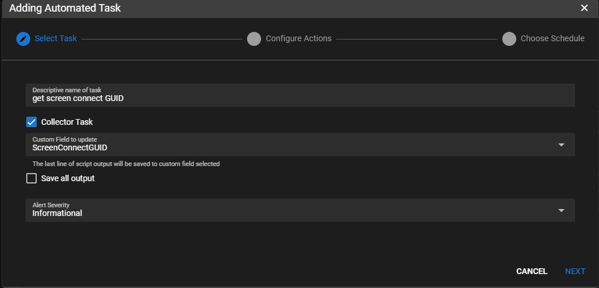
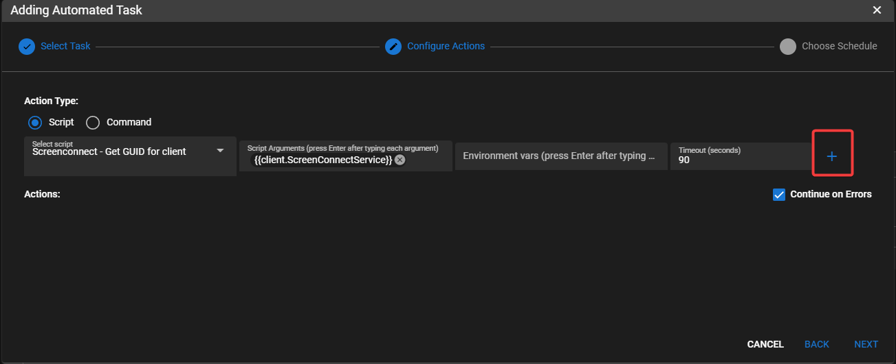

# ScreenConnect / ConnectWise Control

## ConnectWise Control Integration

!!!info
     To make this work you will need the name of the service from one of your agents running a ScreenConnect Guest.

!!!info
     You can setup a full automation policy to collect the machine GUID, but this example will collect from just one agent for testing purposes.

From the UI go to **Settings > Global Settings > CUSTOM FIELDS > Agents**.

Add Custom Field:</br>
**Target** = `Client`</br>
**Name** = `ScreenConnectService`</br>
**Field Type** = `Text` </br>
**Default Value** = `ScreenConnect Client (XXXXXXXX)` (make sure to copy paste the exact windows service name here)</br>


Add Custom Field:</br>
**Target** = `Agent`</br>
**Name** = `ScreenConnectGUID`</br>
**Field Type** = `Text`</br>


While in Global Settings go to **URL ACTIONS**

Add a URL Action:</br>
**Name** = `ScreenConnect`</br>
**Description** = `Launch Screen Connect Session`</br>
**URL Pattern** =

```html
https://<your_screenconnect_fqdn_with_port>/Host#Access/All%20Machines//{{agent.ScreenConnectGUID}}/Join
```


Navigate to an agent with ConnectWise Service running (or apply using **Settings > Automation Manager**).</br>
Go to Tasks.</br>
Add Task:</br>
**Descriptive name of task** = `get screen connect GUID`</br>
**Collector Task** = `CHECKED`</br>
**Custom Field to update** = `ScreenConnectGUID` (Agent)</br>



Click **Next**</br>

**Select Script** = `ScreenConnect - Get GUID for client` (this is a builtin script from script library)</br>
**Script argument** = `{{client.ScreenConnectService}}` (it should auto-fill)</br>

**Click the plus sign**</br>




Choose a schedule for the collector to run then add the task.

Once the task has synced with the agent, right click on the newly created task and click **Run Task Now**.

Give it a second to execute, refresh the tasks tab and then check the output of the task and make sure you see a GUID.

Right click the agent that you are working with and go to **Run URL Action > ScreenConnect**.

It should ask you to sign into your ConnectWise Control server if you are not already logged in and launch the session.

*****

## Install ScreenConnect via Tactical

Use the [ScreenConnect AIO script](https://github.com/amidaware/community-scripts/blob/main/scripts/Win_ScreenConnectAIO.ps1)


## Install Tactical RMM via ScreenConnect Commands Window

1. Create a Deployment under **Agents > Manage Deployments**
2. Replace `<deployment URL>` below with your Deployment Download Link.

```powershell
#!ps
#maxlength=500000
#timeout=600000

Invoke-WebRequest "<deployment URL>" -OutFile ( New-Item -Path "c:\ProgramData\TacticalRMM\temp\trmminstall.exe" -Force )
$proc = Start-Process c:\ProgramData\TacticalRMM\temp\trmminstall.exe -ArgumentList '-silent' -PassThru
Wait-Process -InputObject $proc

if ($proc.ExitCode -ne 0) {
    Write-Warning "$_ exited with status code $($proc.ExitCode)"
}
Remove-Item -Path "c:\ProgramData\TacticalRMM\temp\trmminstall.exe" -Force
```

*****
