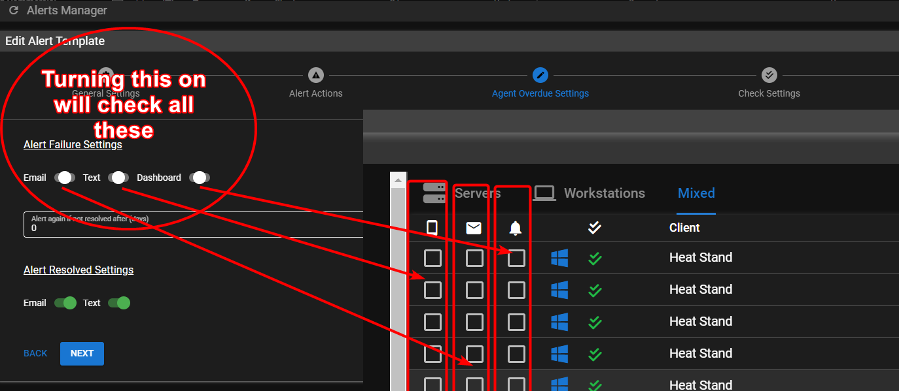
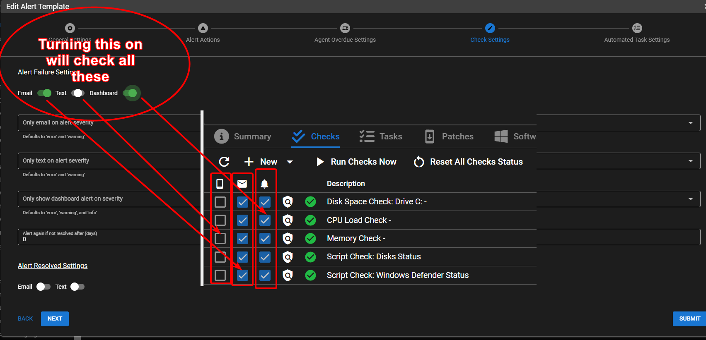

# Alerting Overview

Alerting and notifications can be managed centrally using Alert Templates. All an alert template does is configure the Email, Text, and Dashboard alert check boxes on Agents, Checks, and Automated Tasks.

Using Alert Templates also enables additional features like:

- Periodic notifications if an alert is left unresolved.
- Being able to notify on certain alert severities.
- Sending notifications when an alert is resolved.
- Executing scripts when an alert is triggered or resolved.

[Setting up Email Alert Examples](emailsms_alert.md)

## Supported Notifications

- **Email Alerts** - Sends email to configured set of email addresses.
- **SMS Alerts** - Sends text messages to configured set of numbers.
- **Dashboard Alerts** - A notification popup will show up and be visible in the dashboard.
- **Webhooks** - Send an API request.

## Alert Severities

!!!info
    Agent overdue alerts are always of severity: `Error`

Alert severities are configured directly on the Check or Automated Task. When the Check or Automated Task fails, it will create an alert of the specified severity. The severity types are:

- Informational
- Warning
- Error

## Creating Alert Templates

To create an alert template, go to **Settings > Alerts Manager**, then click **New**.

The available options are:

### General Settings

- **Name** - The name that is used to identify the Alert Template in the dashboard.
- **Email Recipients** - Sets the list of email recipients. If this isn't set the email recipients in global settings will be used.
- **From Email** - Sets the From email address of the notification. If this isn't set the From address from global settings is used.
- **SMS Recipients** - Sets the list of text recipients. If this isn't set the sms list from global settings is used.

### Alert Action Settings

For optionally triggering an additional task (Send a Web Hook, Run Script on Agent, Run script on TRMM Server) when desired (can be left blank for no action).

#### Alert Failure Settings / Alert Resolved Settings

#### Send a Web Hook

You can create your own webhooks to be sent out on alert failure/resolved events, like a script check or task failing or an agent going overdue.

You have access to any of the [variables](https://docs.tacticalrmm.com/script_variables/) as well as [custom fields](custom_fields.md) / [global keystore](keystore.md) inside the json payload of the webhook as well as in the URL patter.

1. Create your [Web Hooks](webhooks.md)

2. Choose the Web Hook you wish to be ran as the alert failure and/or resolved action.

#### Run script on Agent

- **Script** - Runs the selected script once. It attempts to run it on the agent in question, but if not online TRMM selects a random agent to run on.
- **Script arguments** - Optionally pass in arguments to the script.
- **Script environment vars** - Optionally pass in env vars to the script.
- **Action Timeout** - Sets the timeout for the script.

#### Run script on Server

!!!warning
    This is a [dangerous feature](../functions/permissions.md#permissions-with-extra-security-implications) and you must ensure permissions are appropriate for your environment.

<div class="video-wrapper">
  <iframe width="400" height="225" src="https://www.youtube.com/embed/Qh9BfKo2wIg" frameborder="0" allowfullscreen></iframe>
</div>

This runs the script on your TRMM server. To ensure proper execution, you must specify the interpreter for your script using a shebang line at the top of each script. Also make sure that the specified interpreter is installed on your TRMM server.

Just like with webhooks, you also have access to the same [variables](https://docs.tacticalrmm.com/script_variables/) as well as [custom fields](custom_fields.md) / [global keystore](keystore.md) in the script's arguments or environment variables.

=== ":material-language-python: Python (included with TRMM)"

    Shell type: `Shell`
    
    ```py
    #!/rmm/api/env/bin/python

    import sys

    print(sys.version)
    ```

=== ":material-language-python: Python (system python)"

    Shell type: `Shell`
    
    ```py
    #!/usr/bin/python3
    import sys

    print(sys.version)
    ```

=== ":material-bash: Bash"

    Shell type: `Shell`
    
    ```bash
    #!/usr/bin/env bash

    echo "hello world"
    ```

=== ":material-powershell: Powershell (7 PWSH)"

    To install: <https://learn.microsoft.com/en-us/powershell/scripting/install/install-debian>

    Shell type: `Powershell`
    
    ```powershell
    #!/usr/bin/pwsh

    Write-Output "Hello World"
    ```

=== ":material-nodejs: node (included with TRMM)"

    Shell type: `Shell`

    ```
    #!/usr/bin/node

    console.log("Hello World")
    ```

=== ":simple-deno: deno (must be installed)"

    Shell type: `Deno`

    ```
    #!/usr/bin/env -S /usr/local/bin/deno run --allow-allow

    async function gatherSystemInfo() {
    const os = Deno.build.os;
    const arch = Deno.build.arch;
    const memory = Deno.systemMemoryInfo();


    const info = `
    OS: ${os}
    Architecture: ${arch}
    Total Memory: ${(await memory).total / 1024 / 1024} MB
    Free Memory: ${(await memory).free / 1024 / 1024} MB
    `;

    console.log(info);
    }

    gatherSystemInfo().catch(console.error);
    ```

- **Script** - Runs the selected script once on the TRMM server.
- **Script arguments** - Optionally pass in arguments to the script.
- **Script environment vars** - Optionally pass in env vars to the script.
- **Action Timeout** - Sets the timeout for the script.

#### Run actions only on

Turn the switch on if you want the above Alert Failure/Alert Resolved script to run on:

- **Agents** - If Enabled, will run script failure / resolved actions on agent overdue alerts, else no alert actions will be triggered for agent overdue alerts.
- **Checks** - If Enabled, will run script failure / resolved actions on check alerts, else no alert actions will be triggered check alerts.
- **Tasks** - If Enabled, will run script failure / resolved actions on automated task alerts, else no alert actions will be triggered automated task alerts.

### Agent Overdue Setting



- **Email** - When **Enabled**, will send an email notification and override the Email Alert checkbox on the Agent / Check / Task. When **Not Configured**, the Email Alert checkbox on the Agent / Check / Task will take effect. If **Disabled**, no email notifications will be sent and will override any Email alert checkbox on the Agent / Check / Task.
- **Text** - When **Enabled**, will send a text notification and override the SMS Alert checkbox on the Agent / Check / Task. When **Not Configured**, the SMS Alert checkbox on the Agent / Check / Task will take effect. If **Disabled**, no SMS notifications will be sent and will override any SMS Alert checkbox on the Agent / Check / Task.
- **Dashboard** - When **Enabled**, will send a dashboard notification and override the Dashboard Alert checkbox on the Agent / Check / Task. When **Not Configured**, the Dashboard Alert checkbox on the Agent / Check / Task will take effect. If **Disabled**, no SMS notifications will be sent and will override any Dashboard Alert checkbox on the Agent / Check / Task.
- **Alert again if not resolved after (days)** - This sends another notification if the alert isn't resolved after the set amount of days. Set to 0 to disable this.
- **Alert on severity** - Only applicable to Check and Task alert notifications. This will only send alerts when they are of the configured severity.

    !!!info
        Alert on Severity needs to be configured for check and task notifications to be sent!

### Check Settings / Automated Task Settings




- **Email** - If enabled, sends an email notification when an alert is resolved.
- **Text** - If enabled, sends a text messaged when an alert is resolved.

## Applying Alert Templates

Alert templates can be configured:

- Globally at the [Server Level](global_settings.md#general)
- By [Automation Policy](automation_policies.md)
- Manually at the Client Level
- Manually at the Site Level

- To apply **Globally**, navigate to **Settings > Global Settings**. Set the **Alert Template** dropdown and save.
- You can configure an alert template on an automation policy by navigating to **Settings > Automation Manager**, and clicking the **Assign Alert Template** click on the policy, or right-clicking the policy and selecting **Assign Alert Template**.
- To configure on a Client or Site right-click on one in the Client / Site tree view and select **Assign Alert Template**.

## Alert Template Exclusions

You can exclude Clients, Sites, and Agents from Alert Templates. To do this you can:

- Right-click on the **Alert Template** in **Alerts Manager** and select **Exclusions**.
- Select the **Alert Exclusions** link in the Alert Template row.

You can also **Exclude Desktops** from the alert template. This is useful if you only care about servers.

## Alert Template Inheritance

Alerts are applied in the following order. The agent picks the closest matching alert template.

1. Policy w/ Alert Template applied to Site
2. Site
3. Policy w/ Alert Template applied to Client
4. Client
5. Default Alert Template

## Setting up Alert Severities with scripts

If scripting for alert severities please see below, 

1. Create a script with exit codes. The exit codes can be anything other than 0 (which is reserved for passing). Below we are using 2 as a Warning and 5 as Informational, any other code will be assumed to be an Error)
   
    ```ps
    If (!(test-path c:\ProgramData\TacticalRMM\temp)) {
        New-Item -ItemType Directory -Force -Path "C:\ProgramData\TacticalRMM\temp"
        $exitcode = 2
        $host.SetShouldExit($exitcode)
        exit
    }
    Else {
        Write-Output "found folder"
        $exitcode = 5
        $host.SetShouldExit($exitcode)
        exit
    }
    ```

2. Setup a script check and fill in the corresponding Warning and Informational codes (don't forget to hit enter). 
3. Save script check and you should now have the different Severities.
