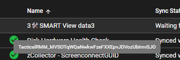

# Automated Tasks

An Automated Task in TRMM is an item that is created in the Windows Task Scheduler. 

You can hover your mouse over the Task name to see what the Task Scheduler item is for that event.

As with [all things relating to agent events](../howitallworks.md#understanding-trmm) they must be online and connected to TRMM.

## Task Triggers

### Time Based

**Daily, Weekly, or Monthly**: All those are just as you'd expect

**Run Once**: Future times are run in an obvious manner. If set in the past, it's actually created for 5 mins after the Windows Task is created on the agent. This is to make that task run at least once because the Windows Task scheduler will never run a task that as a run once date in the past.

### On check failure

This is a secondary script run for any kind of Check failure to fix problems. 

eg. If you have a Memory Check that warns at 80% and Errors at 90%. You can create a Task that would run. If 80-89% memory usage popup a Toast message saying something like "You are using more memory than you have RAM for. Your computer will start slowing down, please close some programs or browser tabs to use less RAM". For 90%+ memory usage you can say "Free memory extremely low, please reboot. Contact support to discuss purchasing more RAM if you see this message frequently".

### Onboarding

This is your primary Task type to do Run once onboarding tasks. As soon as the Windows Task is created on the agent, it is immediately triggered to run. Use this for setting defaults on workstations, install software, and otherwise configure machines. Adding these with [Automation Policies](automation_policies.md) that are applied to appropriate machines is a great way to setup machines for the first time.

### Manual

As the name implies, it's a manual only task that must be manually triggered.

eg. I have a manual Defender cleanup task. When I receive an alert about a Windows Defender detection it's brought to my attention with SMS and support ticket creation (see [webhooks](webhooks.md)). Because Defender is constantly adding more items to it's spyware detection list my backup system will frequently find items in the Download folder of installers that contain Adware/browser toolbar installers etc. Once I review the detection to make sure manual intervention isn't required, I have a manual task I'll trigger that will:

- Delete all Shadow Copies from VSS (to clean out any other versions inside VSS snapshots)
- Create a new VSS Snapshot
- Clean the Defender logs so I won't get more alerts about this event from my Event Log based Defender monitoring script
- Run a Full Defender scan on the machine

## Task Actions

You can run any script from your Script library or Batch or Powershell command. You can run multiple scripts/commands in sequence and have it continue, or stop depending on if it errors.

## Collector Tasks

Collector tasks allow saving data from script output directly to a custom field. The collector task will only save the last line of standard output of the script.

You can create collector tasks by adding it to an Automation Policy or adding it directly to an agent. During creation, select the **Collector** checkbox and select the custom field to save to. 

!!!note
    You can only save to agent custom fields at this time.

See [Custom Fields](custom_fields.md) and [Scripting](scripting.md) for more information
