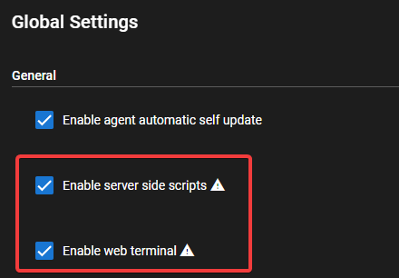

# User Roles and Permissions

## Permissions with extra Security implications

### Core

!!!warning
    **DO NOT** use the Web Terminal for updating Tactical versions or certs

* Use TRMM Server Web Terminal
* Run Scripts on TRMM Server

Both of these functions are running under your user that you installed TRMM with (usually `tactical` if you followed the docs).

These give full access to your TRMM server and as a result can give them the ability to fully access your server and become Super Users if you are operating in an environment where techs shouldn't have full access.

You can reduce the `Run Scripts on TRMM Server` risk a little, if you also uncheck `Scripts > Manage Scripts` for limited techs. If you don't do this a tech could create/modify scripts and ensure no powerful linux scripts exist on the server.

These can be disabled in the web UI, and can also be globally disabled by adding to your `/rmm/api/tacticalrmm/tacticalrmm/local_settings.py` these two options:

```py
TRMM_DISABLE_SERVER_SCRIPTS
TRMM_DISABLE_WEB_TERMINAL
```



## Permission Manager

Make sure you've setup at least 1 valid (Super User aka Administrator) role under _Settings > Permission Manager_

1. Login as usual Tactical user
2. Go to Settings - Permissions Manager
3. Click New Role
4. You can all the role anything, I called it Admins
5. Tick the Super User Box/or relevant permissions required
6. Click Save then exit Permissions Manager
7. Go to Settings - Users
8. Open current logged in user/or any other user and assign role (created above step 6) in the Role drop down box.
9. Click Save 

Once you've set that up a Super User role and assigned your primary user, you can create other Roles with more limited access.

!!!tip
    If you are only trying to give permissions to one or more sites within a client, but not all of the sites, then leave the "Allowed Clients" field blank and only add sites to "Allowed Sites". If a client is set in "Allowed Clients" that will override any site perms and give access to all sites within that client, regardless of what sites are set.

## Video Walkthru

<div class="video-wrapper">
  <iframe width="400" height="225" src="https://www.youtube.com/embed/TTPLvgjMgp0" frameborder="0" allowfullscreen></iframe>
</div>
