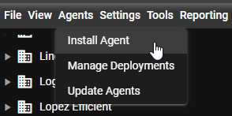
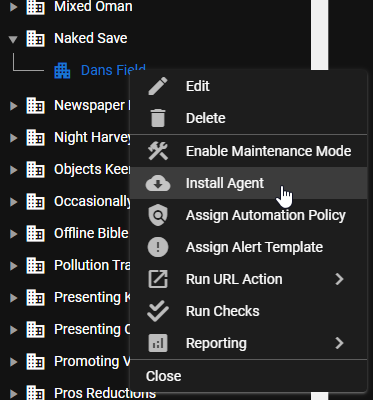
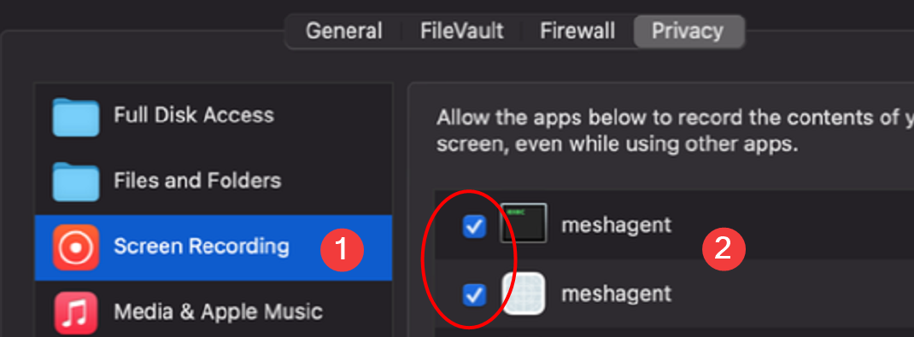

# Installing a Windows Agent

!!!warning
    If you don't want to deal with AV flagging / deleting your agents, check the instructions for getting [code signed agents](code_signing.md).<br/><br />
    You must add antivirus exclusions for the tactical agent.<br/>
    Any decent AV will flag the agent as a virus, since it technically is one due to the nature of this software.<br/>
    Adding the [following exclusions](https://github.com/amidaware/community-scripts/blob/main/scripts/Win_TRMM_AV_Update_Exclusion.ps1) will make sure everything works, including agent update:<br/>
    ```ps
    #Windows Defender Exclusions for Tactical
    Add-MpPreference -ExclusionPath "C:\Program Files\Mesh Agent\*"
    Add-MpPreference -ExclusionPath "C:\Program Files\TacticalAgent\*"
    Add-MpPreference -ExclusionPath "C:\ProgramData\TacticalRMM\*"
    # For agent updates. Inno setup temp directory
    Add-MpPreference -ExclusionPath "%TEMPDIR%\is-*.tmp\tacticalagent*"
    ```
    See [here for other screenshot examples](av.md).

## UI

Click **Agents > Install Agent**.



You can also **right click on a site > Install Agent**. This will automatically fill in the client / site dropdown for you.




## Manual


The 'Manual' installation method requires you to first download the Inno Setup installer and call it using command line args.

This is useful for scripting the installation using Group Policy or some other batch deployment method.

This or the Powershell method are also the preferred method of installing if you don't want [this](./faq.md#help-ive-been-hacked-and-there-are-weird-agents-appearing-in-my-tactical-rmm) to happen.

## Dynamically Generated Executable

The dynamically generated exe is a standalone binary which is simply a wrapper around the Manual install method, using a single exe / command without the need to pass any command line flags to the installer.
All it does is download the Inno Setup installer and call it using predefined command line args that you choose from the web UI.
It "bakes" the command line args into the executable. 
Please note that using this method can result in [this](./faq.md#help-ive-been-hacked-and-there-are-weird-agents-appearing-in-my-tactical-rmm).


## PowerShell

The PowerShell method is also a wrapper around the Manual install method and functionally identical to the dynamically generated EXE installer but in powershell format instead of EXE format.


!!!tip
    You can reuse the installer for any of the deployment methods, you don't need to constantly create a new installer for each new agent.<br/>
    The installer will be valid for however long you specify the token expiry time when generating an agent.

## Using a Deployment Link

The main benefit of this method is that the executable is generated only whenever the deployment download link is accessed, whereas with the other methods it's generated right away and the agent's version is hardcoded into the exe.
Using a deployment link will allow you to not worry about installing using an older version of an agent, which will fail to install if you have updated your RMM to a version that is not compatible with an older installer you might have lying around. The deployment link method uses the dynamic EXE method behind the scenes.

To create a deployment, from the web UI click **Agents > Manage Deployments**.


!!!tip
    Create a client / site named "Default" and create a deployment for it with a very long expiry to have a generic installer that can be deployed anytime at any client / site.
    You can then move the agent into the correct client / site from the web UI after it's been installed.

Copy / paste the download link from the deployment into your browser. It will take a few seconds to dynamically generate the executable and then your browser will automatically download the exe.

## Optional Installer Args

The following optional arguments can be passed to any of the installation method executables:

```text
--log debug
```

Will print very verbose logging during agent install. Useful for troubleshooting agent install.

```text
--silent
```

This will not popup any message boxes during install, including any error messages or the "Installation was successful" message box that pops up at the end of a successful install.

```text
--proxy "http://proxyserver:port"
```

Use a http proxy.

```text
--meshdir "C:\Program Files\Your Company Name\Mesh Agent"
```

Specify the full path to the directory containing `MeshAgent.exe` if using custom agent branding for your MeshCentral instance.

```text
--nomesh
```

Do not install MeshCentral agent during Tactical agent install. Note: Take Control, Remote Terminal and File Browser will not work.

You can get full command line options from (`--help`).

## Scripting Agent Installation

If you want to deploy the TRMM agent using AD, Intune, Mesh, TeamViewer, Group Policy GPO, etc, this is a sample CMD script for deploying Tactical.

???+ note "Install Scripts"

    === ":material-console-line: batch file"

        !!!note
            You will need to replace `deployment url` with your custom deployment URL:

        ```bat
        @echo off

        REM Setup deployment URL
        set "DeploymentURL="

        set "Name="
        for /f "usebackq tokens=* delims=" %%# in (
            `wmic service where "name like 'tacticalrmm'" get Name /Format:Value`
        ) do (
            for /f "tokens=* delims=" %%g in ("%%#") do set "%%g"
        )

        if not defined Name (
            echo Tactical RMM not found, installing now.
            if not exist c:\ProgramData\TacticalRMM\temp md c:\ProgramData\TacticalRMM\temp
            powershell Set-ExecutionPolicy -ExecutionPolicy Unrestricted
            powershell Add-MpPreference -ExclusionPath "C:\Program Files\TacticalAgent\*"
            powershell Add-MpPreference -ExclusionPath "C:\Program Files\Mesh Agent\*"
            powershell Add-MpPreference -ExclusionPath C:\ProgramData\TacticalRMM\*
            cd c:\ProgramData\TacticalRMM\temp
            powershell Invoke-WebRequest "%DeploymentURL%" -Outfile tactical.exe
            REM"C:\Program Files\TacticalAgent\unins000.exe" /VERYSILENT
            tactical.exe
            rem exit /b 1
        ) else (
            echo Tactical RMM already installed Exiting
        Exit 0
        )
        ```

    === ":material-powershell: powershell"

        ```powershell
        # Update variables
        $deploymenturl = "<deployment URL>"
        $agentstoinstall = 1 # Replace with the number of agents to install if greater than 20

        # Do not modify below here
        $randomSleepTime = if ($agentstoinstall -gt 1) { Get-Random -Minimum 1 -Maximum (($agentstoinstall + 1) * 2) } else { 1 }
        Start-Sleep -Seconds $randomSleepTime
        Invoke-WebRequest $deploymenturl -OutFile (New-Item -Path "c:\ProgramData\TacticalRMM\temp\trmminstall.exe" -Force)
        $proc = Start-Process "c:\ProgramData\TacticalRMM\temp\trmminstall.exe" -ArgumentList '-silent' -PassThru
        Wait-Process -InputObject $proc
        if ($proc.ExitCode -ne 0) {
            Write-Warning "$proc exited with status code $($proc.ExitCode)"
        }
        Remove-Item -Path "c:\ProgramData\TacticalRMM\temp\trmminstall.exe" -Force
        ```

    === ":material-microsoft: msi"

        * Use `Agents` menu > `Manage Deployments`
        * Generate a deployment link with an expiry date set to very far in the future, then access the link to download the executable.
        * [Create the msi](https://docs.microsoft.com/en-us/mem/configmgr/develop/apps/how-to-create-the-windows-installer-file-msi)
        * Apply via GPO software deployment to the appropriate machines

## Script for Full Agent Uninstall

You can always use this to silently uninstall the agent on workstations:

Choose your method:

=== ":material-console-line: Windows Automatically"

    ```cmd
    "C:\Program Files\TacticalAgent\unins000.exe" /VERYSILENT
    ```

=== ":material-apple: Mac"

    Run: <https://github.com/amidaware/tacticalrmm/blob/develop/api/tacticalrmm/core/mac_uninstall.sh>

=== ":material-linux: linux"

    Download: <https://raw.githubusercontent.com/amidaware/tacticalrmm/develop/api/tacticalrmm/core/agent_linux.sh>

    Run: `./agent_linux.sh uninstall`

## Reinstalling Mesh and Reconnecting to TRMM

Run this from **Send Command**:

```cmd
"C:\Program Files\Mesh Agent\meshagent.exe" -fullinstall
```

Then use **Agent Recovery > Mesh Agent**, and choose **Recover**:

## Stuck at "Downloading mesh agent..."?

Make sure TRMM can connect to Mesh. Run:

```bash
/rmm/api/env/bin/python /rmm/api/tacticalrmm/manage.py check_mesh
```

If there's an error, make sure you have it [setup correctly](howitallworks.md#meshcentral).


## Install Linux Agent (beta)

To install:<br/>
1. Go to rmm.yourdomain.com and login.<br/>
2. Click on Agents > Install Agent.<br/>
3. Choose the Client, Site, Server or Workstation and Architecture (change expiry if required) as well as Linux.<br/>
4. Click Download.<br/>
5. If downloaded on the Linux machine you want to add as an agent (otherwise copy to machine using WinSCP or similar) open terminal. <br/>
6. cd to the folder you have downloaded the script to.<br/>
7. Run `chmod +x rmm-clientname-sitename-type.sh`<br/>
8. Run `sudo ./rmm-clientname-sitename-type.sh` and wait for script to complete.<br/>

If you changed the expiry time you could upload the script to any accessible server and deploy to multiple devices.

```text
-- debug
```

Will print very verbose logging during agent install. Useful for troubleshooting agent install.

## Linux Deployment Link

Currently there are no deploy links for Linux agents however you could use the following method if uploaded somewhere (website etc).

An example deployment script would be (note there's an install token in that script, so delete it when done if you're concerned):

```bash
wget scripturl
chmod +x rmm.sh
./rmm.sh
```

## Mac Agent Permissions

Step 1: Open System Preferences
Click on the Apple logo in the top-left corner of your screen.
Select System Preferences from the dropdown menu.

Step 2: Navigate to Security & Privacy
In the System Preferences window, click on Security & Privacy.
At the top of the Security & Privacy window, click the Privacy tab.


Step 3: Grant Accessibility Permissions
In the list on the left, scroll down and select Accessibility.
If the padlock in the bottom-left corner is locked, click it and enter your password to make changes.
Click the plus (+) button under the list on the right side.
Navigate to and add tacticalagent from the /opt/tacticalagent/ folder and meshagent in the /opt/tacticalmesh/ folder.
Ensure both are checked in the list to grant them Accessibility Permissions.


Step 4: Grant Screen Recording Permissions
In the list on the left, find and select Screen Recording.
Unlock the padlock if necessary as described above.
Click the plus (+) button and add meshagent from the /opt/tacticalmesh/ folder, or check the boxes next to them if they're already listed.
A prompt may appear asking you to quit Meshcentral. Please do so to enable the permissions.



Step 5: Grant Full Disk Access
In the list on the left, scroll down and select Full Disk Access.
Unlock the padlock if necessary as described above.
Click the plus (+) button and add tacticalagent from the /opt/tacticalagent/ folder and meshagent from the /opt/tacticalmesh/ folder, or check the boxes next to them if they're already listed.


Finalizing the Setup
Restart Your Applications: Quit and restart Tactical RMM and Meshcentral for the changes to take effect.
Restart Your Mac: If the applications do not recognize the new permissions, a system restart may be necessary.
