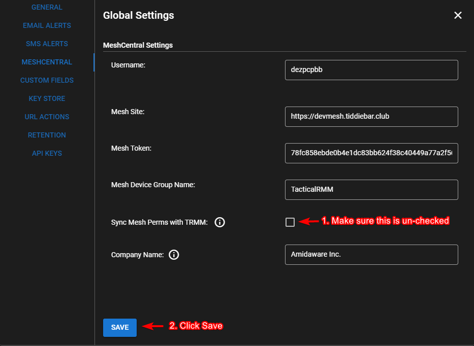
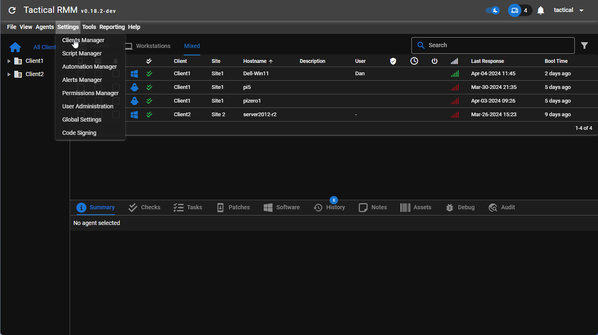

# MeshCentral Integration

## Overview

Tactical RMM integrates with [MeshCentral](https://github.com/Ylianst/MeshCentral) for the following 3 functions:

- Take Control.
- Real time shell.
- Real time file browser.

!!!note
    MeshCentral has issues with Firefox, use a Chromium-based browser.

It should be noted that Tactical RMM and MeshCentral are 2 completely separate products and can run independently of each other.

They do not even have to run on the same box, however when you install Tactical RMM it simply installs MeshCentral for you with some pre-configured settings to allow integration.

It is highly recommended to use the MeshCentral instance that Tactical installs, since it allows the developers more control over it and to ensure things don't break.

## How does it work?

Please watch this video to fully understand how mesh integrations and permissions sync work.

<div class="video-wrapper">
  <iframe width="400" height="225" src="https://www.youtube.com/embed/HS03aIg5S5g" frameborder="0" allowfullscreen></iframe>
</div>

MeshCentral has an embedding feature that allows integration into existing products.

See *Section 14 - Embedding MeshCentral* in the [MeshCentral User Guide](https://ylianst.github.io/MeshCentral/meshcentral/#embedding-meshcentral) for a detailed explanation of how this works.

The Tactical RMM agent keeps track of your Mesh agents, and periodically interacts with them to synchronize the Mesh agent's unique ID with the Tactical RMM database.

When you do a take control / terminal / file browser on an agent using the Tactical UI, behind the scenes, Tactical generates a login token for MeshCentral's website and then "wraps" MeshCentral's UI in an iframe for that specific agent only, using it's unique ID to know what agent to render in the iframe.

## Customize Take Control Username

If you've enabled any of the [remote control options](./tipsntricks.md#enable-remote-control-options) such as "Notify user", "Prompt for consent" and "Show connection toolbar" and you'd like to change the name that users see, make sure the user has a First and/or Last name set TRMM (Settings > User Administration). If you would also like your company name to show, you can set your company name in TRMM > Settings > Global Settings > MeshCentral.

## Turn off the sync feature

If you're having issues with the new MeshCentral sync feature added in TRMM v0.18.0 you can simply disable it to revert back to the previous behavior prior to this release, although you're probably just looking for way to get the [old mesh interface back](#get-a-url-to-login-to-mesh-as-the-mesh-superuser):

From TRMM's web interface go to Settings > Global Settings > MeshCentral

1. Un-check the "Sync Mesh Perms with TRMM" checkbox, and click Yes to the "are you sure" prompt.

2. Click "Save"



## Toggle a full permissions re-sync

From TRMM's web interface go to Settings > Global Settings > MeshCentral

1. Un-check the "Sync Mesh Perms with TRMM" checkbox, and click Yes to the "are you sure" prompt.

2. Click "Save"

3. Re-open the same settings window and check the same checkbox, click yes to the prompt, and Save.

4. Wait a few minutes for the sync to fully complete in the background.

!!! Video
    

## Get a url to login to mesh as the mesh superuser

This will generate a url that will log you into meshcentral as the superuser, the same way it used to be prior to TRMM Release 0.18.0

You should open this in a different browser than the one you're using for TRMM, or open in an incognito window.

```bash
/rmm/api/env/bin/python /rmm/api/tacticalrmm/manage.py get_mesh_login_url
```

## Modifying the Internal Mesh Port Configuration

By default, Tactical RMM configures the Mesh service to listen on the internal port 4430. Should there be a need to modify this default port within the Nginx or Mesh configuration, it is imperative to update Tactical RMM with the new port information. To accomplish this, the following entry must be added to the file `/rmm/api/tacticalrmm/tacticalrmm/local_settings.py`:

```python
MESH_PORT = <new_port_number>
```

Replace `<new_port_number>` with the actual port number you have configured. For example, if the new port number is 1234, the entry should be as follows:

```python
MESH_PORT = 1234
```

Then, restart your entire server for changes to take effect.

## Running your own existing or separate MeshCentral server?

We do testing to make sure everything works with the version found [here](https://github.com/amidaware/tacticalrmm/blob/master/api/tacticalrmm/tacticalrmm/settings.py) (look for MESH_VER).

Installation instructions for using your own MeshCentral server:

1. Run standard installation.
2. After installation is complete, disable meshcentral `sudo systemctl disable --now meshcentral`.
3. In TRMM Web UI go to Settings > Global Settings > MeshCentral and update values from your existing mesh (make sure to use a mesh superuser). Username MUST be all lowercase. Mesh Token find with [this](troubleshooting.md#need-to-recover-your-mesh-token)
4. Add `USE_EXTERNAL_MESH = True` to `/rmm/api/tacticalrmm/tacticalrmm/local_settings.py`
5. Restart TRMM server.

!!!info
    Mesh usernames are **CaSe sEnSiTive**

## Take Control Connect vs RDP Connect


When using `Take Control` from Tactical RMM you are using the Desktop function in MeshCentral

`Connect` button: 

Right-click the button for options.

About the same a VNC, but it's not compatible with VNC. The original VNC protocol did not use JPEG, instead it uses RLE encoding or ZRLE. MeshCentral's remote desktop only uses JPEG (or WEBP in some cases) because browsers can decode JPEG easily.

The MeshAgent will split the desktop into 32x32 pixel tiles and see if any of the tiles have changed. If a group of tiles change since the last frame, a JPEG is sent to update the area.

`RDP Connect` button: 

Is a browser based RDP client. It connects to the native RDP in versions of Windows that support inbound RDP connects. Pro, Workstation, Enterprise, Server, Terminal Server, RDS Server etc. You must enable RDP in Windows to be able to connect to it, it's not enabled by default (or enable when installing agent if supported).

!!!note
    It does not work for Windows Home because Home doesn't support incoming RDP connections.

## Remote Terminal how it works

For the remote terminal, we launch a shell on the remote system and pipe VT100 terminal emulation to/from the browser. On the browser, we use XTermJS to view the terminal session.

## MeshCentral Options

There are [MANY](https://github.com/Ylianst/MeshCentral/blob/master/meshcentral-config-schema.json) MeshCentral options that you can configure. Here are some you might want to investigate:

[`allowHighQualityDesktop`](https://github.com/Ylianst/MeshCentral/blob/d06ca601ffde4602f97147038616ed2331f01624/meshcentral-config-schema.json#L135)

[`desktopMultiplex`](https://github.com/Ylianst/MeshCentral/blob/d06ca601ffde4602f97147038616ed2331f01624/meshcentral-config-schema.json#L149)

[`userAllowedIP`](https://github.com/Ylianst/MeshCentral/blob/d06ca601ffde4602f97147038616ed2331f01624/meshcentral-config-schema.json#L151)

[`agentAllowedIP`](https://github.com/Ylianst/MeshCentral/blob/d06ca601ffde4602f97147038616ed2331f01624/meshcentral-config-schema.json#L153)

[`tlsOffload`](https://github.com/Ylianst/MeshCentral/blob/d06ca601ffde4602f97147038616ed2331f01624/meshcentral-config-schema.json#L170) (for proxy users)

[`maxInvalid2fa`](https://github.com/Ylianst/MeshCentral/blob/d06ca601ffde4602f97147038616ed2331f01624/meshcentral-config-schema.json#L260)

## Using Tactical RMM Without MeshCentral

Install Tactical RMM normally. Then, to disable the MeshCentral Server on the TRMM server run:

```bash
sudo systemctl disable --now meshcentral mongod
```

Then when installing an agent, make sure to pass the `-nomesh` flag to the [installer](install_agent.md#optional-installer-args)

## Fixing missing agents in TRMM or Mesh

???+ note "Fixing Missing agent"

    === ":material-console-line: Agent Missing in Mesh"

        From the Script Library run: `TacticalRMM - Install Mesh Agent if it's not installed`

        Then from trmm web ui right click agent > agent recovery > mesh agent

    === ":material-console-line: Agent Missing in TRMM"

        Use mesh to run the trmm agent installer with the `--nomesh` flag.
        
        Then from trmm web ui right click agent > agent recovery > mesh agent

## OMG MeshCentral isn't maintained anymore!

MeshCentral is still [actively being maintained](https://meshcentral2.blogspot.com/2023/10/meshcentral-windows-arm64-nodejs-v11.html), the lead devs had jobs in which they were paid by a corporation to develop MeshCentral, they now have got other jobs which means they are supporting and developing MeshCentral in their free time (like alot of other projects) this means development is slower but not that it isn't maintained anymore. If this changes or it becomes necessary to fix something that breaks or packages needing updated we are prepared to begin maintaining our own fork. The features of MeshCentral that TRMM uses are only the 3 items above and are extremely mature.

